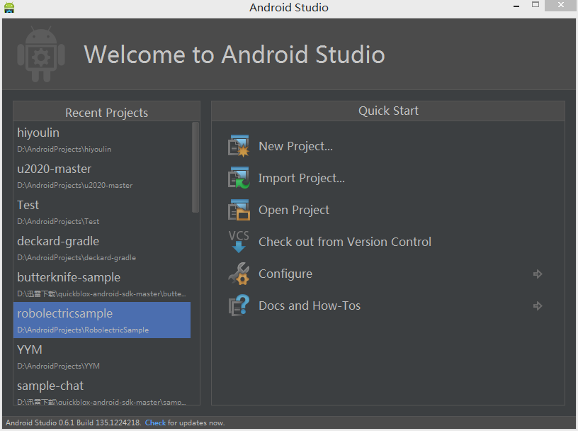
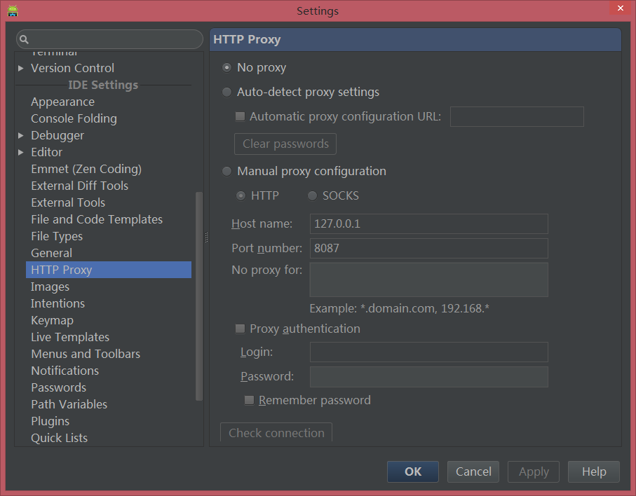
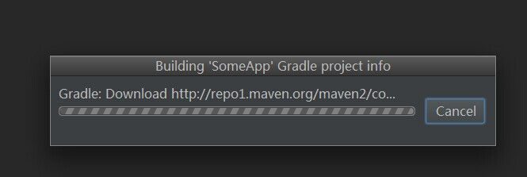
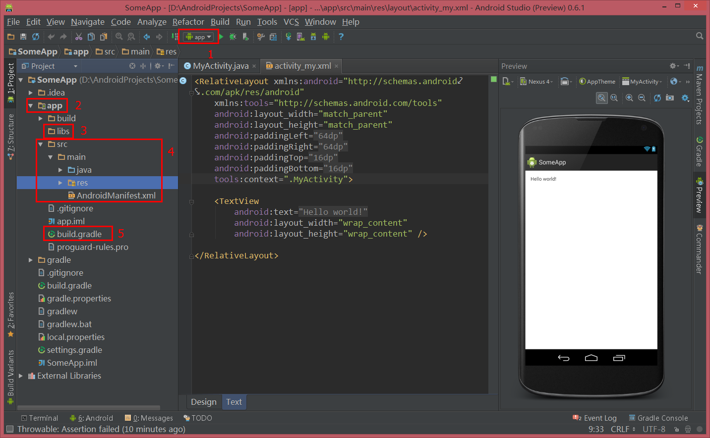
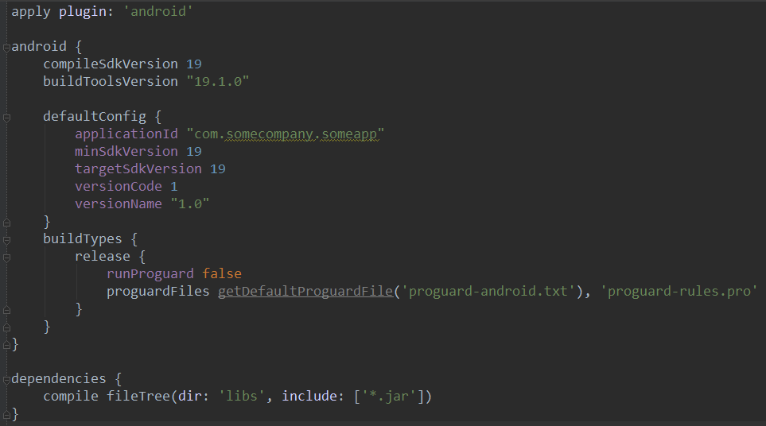

Android Studio 上手指南
=====================

一、Android Studio（以下简称AS）下载和安装
---------------
从 [这里（需翻墙）](https://developer.android.com/sdk/installing/studio.html)下载AS并安装（Windows系统**不要安装在系统盘**），然后打开。 
 

主页提供的AS往往不是最新版的，你需要在初次打开AS后，点击窗口底部的蓝色`check`按钮来更新软件。更新包很小，更新完成之后软件会重启，然后就可以开始使用了。  
_注：如果点击Check按钮后弹出网络连接失败的对话框，说明你所使用的网络需要翻墙才能正常使用AS。如果你使用VPN，开启后再次点击Check按钮；如果你使用GAE，按`Ctrl`+`Alt`+`S`打开Settings，然后在左边列表中找到HTTP Proxy项，勾选Manual proxy configuration，然后把你的GAE设置进去（如下图）。_ 
  

二、建立第一个项目
-----------------
####1. 新建项目
点击`Quick Start`中的`New Project`，按照提示一步步走，点完finish会进入新的界面（此处也有可能需要翻墙，和你使用的网络有关）：  
  

几秒至几十秒之后，对话框消失，项目建立完成！  
 
####2. 图中标记简介  
1. 标志当前Module，点击它右边的绿色三角就可以运行程序了（AS中的Module相当于Eclipse中的Project） 
2. `app`，主Module的目录 
3. `libs`，放置本地库文件的地方，和Eclipse中不一样，请注意 
4. `src`，工程关键目录，AS的项目结构是基于gradle的，和Eclipse大不相同，一定要注意 
5. `app/build.gradle`，主Module的gradle配置文件，程序的所有配置都在这里。build.gradle文件是学习AS最关键的地方，下面详细介绍。 

三、build.gradle文件解析
----------------
gradle很强大，但本文旨在把大家领进门，因此不会讲得太深。接下来，我们对一个新建项目中的app module中的build.gradle文件进行完整的解析。文件内容如下图： 
  
这份文档的内容分为三部分：  
1. 第一行：
```groovy
apply plugin: 'android'
```
这一行表示，该项目是一个Android项目  
2. 由`android`标签包含着的部分：
```groovy
android {
    compileSdkVersion 19
    buildToolsVersion "19.1.0"

    defaultConfig {
        applicationId "com.somecompany.someapp"
        minSdkVersion 19
        targetSdkVersion 19
        versionCode 1
        versionName "1.0"
    }
    buildTypes {
        release {
            runProguard false
            proguardFiles getDefaultProguardFile('proguard-android.txt'), 'proguard-rules.pro'
        }
    }
}
```
`compileSdkVersion`表示编译时使用的SDK版本；  
`buildToolsVersion`表示使用的buildTools版本；  
`applicationId`即App的id，这里简单说一下：从AS 0.6.0开始，AndroidManifest.xml中的packageName的用途被拆分了，今后packageName仅仅用于声明包路径，不再用于App id的定义，App的id由build.gradle中的applicationId单独进行指定。  
`minSdkVersion` `targetSdkVersion` `versionCode` `versionName`这四个属性直接覆盖AndroidManifest.xml中的相应属性。换句话说，在gradle中，定义这四个属性的位置从AndroidManifest.xml中提取到了build.gradle中（但实际build出来的AndroidManifest.xml仍然会有这些属性，这里不再详述）。  
`buildTypes`中的`release`里面的两行信息，第一行表示正式打包的apk包不使用proguard优化，第二行则是指定了proguard文件的位置（在第一行为false时不生效）  
3. 由'dependencies'包含着的部分：
```groovy
dependencies {
    compile fileTree(dir: 'libs', include: ['*.jar'])
}
```
`dependencies`标签内的是项目的所有依赖库。例子中只有一行，这一行表示，在编译时，将libs目录中的所有jar文件作为库文件引入。在实际的项目中，各种本地和在线的库文件与库项目，都会在这里配置。  
_如果想了解更多关于gradle在Android中的使用，可以自行查看Google官方给出的[gradle指导文档](http://tools.android.com/tech-docs/new-build-system/user-guide)。_
