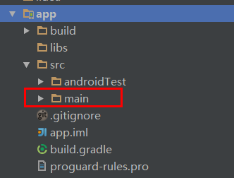
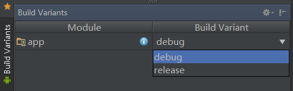
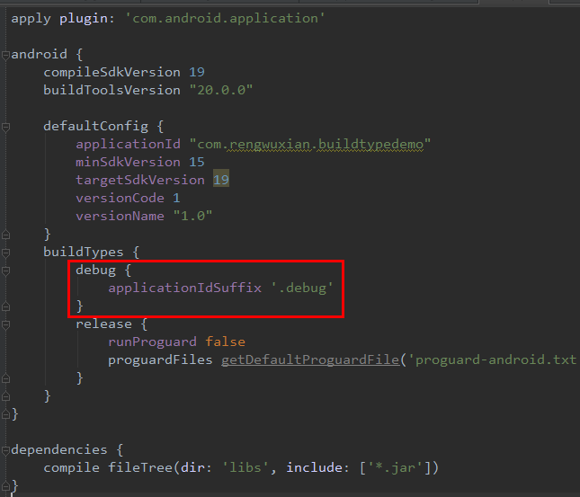
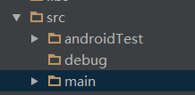
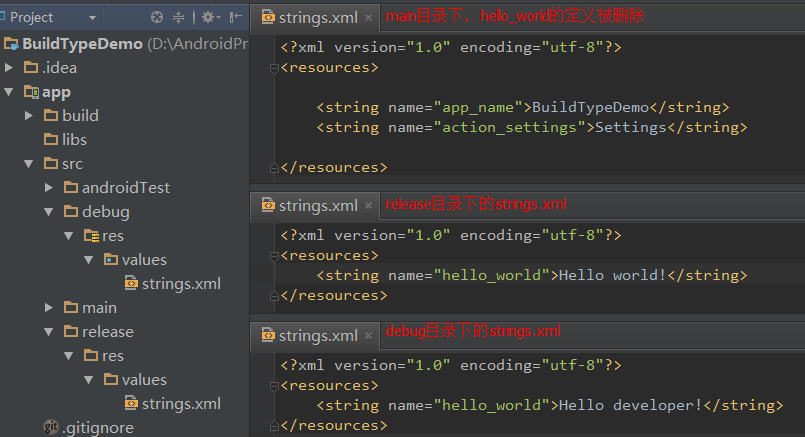

# BuildType

#### 简介

BuildType是gradle中的一个功能，它可以让开发者方便地对App的不同打包版本进行配置，使得不同版本之间的共享代码保持同步，而各自的独立代码也保持独立。

举几个场景：

1. 很多App会提供自己的网络数据，例如新闻应用会提供新闻资讯，社交应用会提供用户和社交数据。为了避免测试时产生垃圾数据或产生更严重的后果，这样的应用往往需要在正式服务器之外建立一个测试服务器供内部测试使用，而App则需要相应地提供相应的测试版本给内部人员使用。
2. App开发时，软件会需要开启一些特殊的设置项，例如Picasso需要打开Debug模式，Retrofit需要开启Mock模式。而在发布版中，这些设置项会被关闭。
3. App开发时，我们会用到一些仅用于调试的库，例如Scalpel，Madge。这些库在发布版中不仅用不到，而且会影响程序的性能和包的大小，因此应该在发布版中将它们从软件中剔除掉，而且是彻底剔除。

如果你需要解决以上的问题，又不知道应该怎么做，或觉得自己当前的办法太麻烦（一天几十次的切换分支快疯了？^_^），那么你应该使用BuildType。

#### 使用方式

先看一下效果图：

对上面的图片补充一下。“友邻小区”这个程序，使用BuildType实现了：

1. 将软件分成了三个版本（开发版、内测版、发布版），利用不同的包名进行打包，并利用图标和ActionBar右上角的三角形色块进行区分。
2. 内测版和发布版使用不同的服务器URL
3. 开发版中加入了Scalpel和Madge，并且提供了右边滑出的Drawer，可以对软件进行多项调试设置的实时更改，而发布版和内测版中则没有（此处参考了Jake Wharton的[u2020](https://github.com/JakeWharton/u2020))

下面我将详细介绍如何使用BuildType来将软件拆分为`debug`版（开发版）和`release`版（发布版）这两个版本。

一个新建立的基于gradle的Android项目，它的`src`目录下，除了`androidTest`目录外，只有一个`main`目录。这个目录就是Java代码的目录，如下图：

直接运行程序：

接下来我要建立一个debug版，让App在debug中显示“Hello developer!”而不是“Hello world!"。

基于gradle的Android项目，默认的BuildType有`debug`和`release`两种，并且默认为`debug`版
。你可以点开Android Studio左下角的`Build Variants`查看：

我要为`debug`版设置独立的applicationId（gradle插件0.11之后，build.gradle新增applicationId变量取代packageName，从此以后与AndroidManifest.xml中的packageName分离），以保证`debug`版能够和`release`版能够共存安装：

除此之外，我还要分别建立`debug`目录和`release`目录：

最后一步，将字符串`hello_world`的定义从`main`目录中删除，并分别为`debug`目录和`release`目录设置该字符串：

到此，配置完成。再次运行App，界面显示变成了“Hello Developer!"：

而如果通过上面用过的`Build Variants`工具切换到`release`版，再次运行，将会运行`release`版，而界面仍然将将会显示“Hello world!”。

_注意：release版程序需要设置signingConfig，本文不再详述。_

_如果希望了解更多关于基于gradle的Android项目的知识，请参看[官方文档](http://tools.android.com/tech-docs/new-build-system/user-guide)，或关注我之后发布的其他Android Studio相关教程。_

_另外，我们公司[友邻小区](hiyoulin.com)招聘Android开发一名，地址北京海淀，职位描述明天才能添加，着急的请参看我们的[iOS招聘](http://www.lagou.com/jobs/77945.html)，有兴趣的话请发个人简历至我的邮箱 zhukai@hiyoulin.com。_

_我的Github：https://github.com/rengwuxian_
